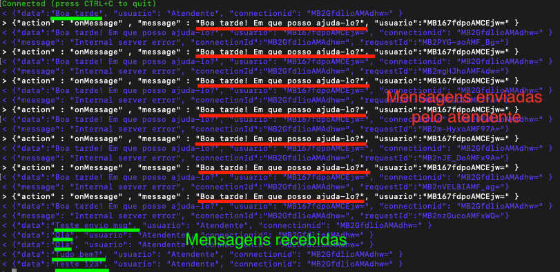

# SaraivaFAQ
Aplicativo desenvolvido para demonstrar o funcionamento do chatbot da google dialogflow utilizando o framework react native, integrado com a Amazon api gatway para realizar o redirecionado para um chat humano.

O dialogflow foi alimentado com os dados do FAQ da saraiva https://www.saraiva.com.br/central-de-atendimento.

https://play.google.com/store/apps/details?id=com.saraivafaq&hl=pt_BR

A ideia com a evolução desse projeto é criar uma arquitetura simples e robusta para oferecer uma forma simples de empresas criarem seu chatbot e realizarem a integração com os atententes humanos.

# Dialog Flow

Utilizando o Dialogflow que é uma plataforma para construir interfaces de conversação para bots, aplicativos e dispositivos com linguagem natural que incorpora o contexto da conversa, como histórico de diálogo, localização e preferências do usuário. Possui uma das melhores interfaces para construção de aplicações com PLN (Processamento de linguagem natural), em setembro de 2016, ela foi adquirida pelo Google, o que evidencia o poder da plataforma e o tanto que ela ainda vai evoluir.
O Dialogflow trabalha com o seguinte conceito:

Agente: Os agentes podem ser descritos como sendo o módulos NLU. Seu objetivo é transformar o idioma natural do usuário em dados acionáveis.

Entidades: As entidades representam conceitos e servem como uma poderosa ferramenta para extrair valores de parâmetros de entradas de linguagem natural.

Contextos: Contextos são cadeias de caracteres que representam o contexto atual do pedido de um usuário.

Parâmetros: As ações podem ter parâmetros para extrair informações das entradas de usuários.

Intenções: Uma intenção representa um mapeamento entre o que o usuário diz e quais ações devem ser tomadas pelo seu software.

# Amazon API Gateway

Caso o usuário digite algo que o dialogflow entenda que o usuário queira conversar com um humano, o sistema redireciona seu atedimento para um chat humano utilizando a Amazon API Gateway que é um serviço da AWS para criação, publicação, manutenção, monitoramento e proteção de APIs REST e WebSocket em qualquer escala. Os desenvolvedores de API podem criar APIs que acessem a AWS ou outros web services, bem como dados armazenados na Nuvem AWS. Como um desenvolvedor de API do API Gateway, você pode criar APIs para uso em seus próprios aplicativos cliente. Ou você pode disponibilizar suas APIs para desenvolvedores de aplicativos de terceiros.

A Amazon API Gateway permite a criação de aplicativos de comunicação bidirecional usando APIs WebSocket no Amazon API Gateway sem precisar provisionar e gerenciar nenhum servidor.

As APIs baseadas em HTTP usam um modelo de solicitação / resposta com um cliente enviando uma solicitação para um serviço e o serviço respondendo de forma síncrona ao cliente. As APIs baseadas no WebSocket são de natureza bidirecional. Isso significa que um cliente pode enviar mensagens para um serviço e os serviços podem enviar mensagens para seus clientes independentemente.

Esse comportamento bidirecional permite tipos mais ricos de interações cliente / serviço, porque os serviços podem enviar dados aos clientes sem que um cliente precise fazer uma solicitação explícita. As APIs do WebSocket são frequentemente usadas em aplicativos em tempo real, como aplicativos de bate-papo, plataformas de colaboração, jogos com vários jogadores e plataformas de negociação financeira.

![Funcionamento integração chat humano]
Abaixo é exibido o funcionamento do da integração entre usuário e operador, o operador está enviando as mensagens via console.

